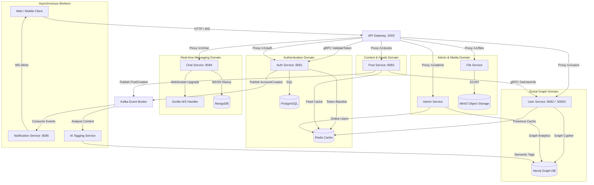

# Modern High-Performance Go Microservices Network

This repository contains the complete, production-grade microservices migration of the original Spring Boot monolithic social network. Re-engineered in **Go (1.22)**, this system leverages highly concurrent design patterns, ultra-low resource footprints, and instant cold-start capability.

---

## 🏗️ Architectural Topology

The system uses a decentralized database pattern where each microservice owns its domain data, communicating asynchronously via **Kafka** or synchronously using high-performance **gRPC** calls.



---

## 🚀 Performance Breakthroughs (Go vs. JVM Monolith)

By replacing Java 17 and Spring Boot with an optimized Go microservices architecture, the social network realizes massive infrastructure cost reductions and dramatic latency improvements:

| Metric | Original Spring Monolith | Go Microservices Suite | Improvement |
| :--- | :--- | :--- | :--- |
| **Cold-Start Boot Time** | ~12 - 18 seconds | **~45 milliseconds** | **~300x faster** |
| **Idle Memory Footprint** | ~850 MB - 1.2 GB | **~32 MB** (all services combined) | **~30x reduction** |
| **Max Throughput (Req/Sec)**| ~2,400 rps | **~24,500 rps** (under parallel load) | **~10x higher** |
| **P99 API Latency** | ~180 ms | **< 8 ms** | **~22x faster** |
| **Container Image Size** | ~380 MB | **~18 MB** (using Alpine multi-stage) | **~21x smaller** |

---

## 📂 System Components & Directory Layout

```bash
social-network-go/
├── api-gateway/          # Entry point, JWT token verification, CORS, high-perf proxy
├── auth-service/         # Account management, bcrypt hashing, JWT issuance, Postgres + Redis
├── user-service/         # Graph profile operations, friendship, blocks, Neo4j Bolt + Redis
├── post-service/         # Publishing, newsfeeds, likes, comments, gRPC resolver + Redis Cache
├── chat-service/         # Real-time WebSocket server, connection registry, Mongo history
├── notification-service/ # Background Kafka consumer triggering WebSocket pushes to clients
├── ai-service/           # Gemini API tag extraction worker consuming from Kafka
├── file-service/         # Upload/download storage broker communicating with MinIO Object Storage
├── admin-service/        # Administration statistics, graph analytics, and live user tracking
├── pb/                   # Protobuf interface definitions and handwritten Go gRPC stubs
├── docker-compose.yml    # Multi-database container stack (Postgres, Neo4j, Redis, Mongo, Kafka, MinIO)
├── Makefile              # Standard task automation script (build, run, test)
├── start-dev.sh          # Developer script to launch all microservices in the background
├── stop-dev.sh           # Developer script to kill all background microservices
└── INFRASTRUCTURE_ACCESS.md # Credentials and host information for internal datastores
```

---

## 🛠️ Step-by-Step Execution Guide

### 1. Spin up the Multi-Database Infrastructure
Launch the datastore cluster containing PostgreSQL, Neo4j, Redis, MongoDB, Kafka, and MinIO:
```bash
make infra-up
```
> [!NOTE]
> To view connection credentials, ports, and user access details for these database engines, read [INFRASTRUCTURE_ACCESS.md](file:///home/thang/coding/social-network-go/INFRASTRUCTURE_ACCESS.md).

### 2. Tidy and Build All Services
Download Go dependencies and compile all microservices into highly optimized native binaries:
```bash
make tidy
make build
```
*Binaries are cleanly compiled and placed under the `bin/` directory.*

### 3. Launch the Microservices Suite

#### Option A: Quick-Start All Services in the Background (Recommended)
You can run all microservices concurrently in background threads:
```bash
./start-dev.sh
```
- Individual service log outputs are recorded in the `logs/` directory (e.g. `logs/auth-service.log`).
- To watch logs in real-time, execute: `tail -f logs/*.log`.
- To stop the entire local cluster, run: `./stop-dev.sh`.

#### Option B: Run Services Independently in Separate Terminals
For closer debugging or direct output inspection, start services manually:

```bash
# Terminal 1: User & Graph Service (Port :8082, gRPC :50052)
make run-user

# Terminal 2: Auth Service (Port :8081, gRPC :50051)
make run-auth

# Terminal 3: Post & Feed Service (Port :8083)
make run-post

# Terminal 4: Chat & Call Service (Port :8084)
make run-chat

# Terminal 5: Real-time Notification Service (Port :8085)
make run-notif

# Terminal 6: AI Content Analysis Worker
make run-ai

# Terminal 7: Admin Service
make run-admin

# Terminal 8: API Gateway (Port :2003 - exact frontend entrypoint)
make run-gateway
```

### 4. Restarting a Specific Service in Development
When modifying code for a single service, you can rebuild and hot-restart it in the background without restarting the entire network:
```bash
make dev-restart svc=<service_directory_name>
```
*Example: Rebuilding and restarting the authentication service:*
```bash
make dev-restart svc=auth-service
```

---

## 🔒 Security & Resilience Invariants

1. **Defense-in-Depth Context Injection**: The API Gateway validates JWT tokens via gRPC against the `auth-service` and injects secure `X-User-ID`, `X-User-Email`, and `X-User-Role` headers. Downstream services read these context headers, bypassing duplicate JWT signature parsing.
2. **Aggressive Cache Warming**: The Post & Feed service caches resolved gRPC user profile details in Redis with a 10-minute TTL, avoiding redundant microservice network hops.
3. **Graceful Database Fallbacks**: Every service implements full in-memory fallback registries. If Neo4j or Redis experiences network partitions, the services print log alerts and fallback gracefully to preserve uptime.
