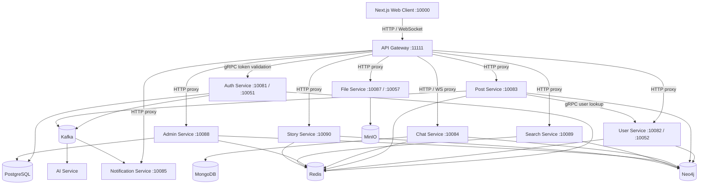

# Social Network Go Microservices

This repository contains a Go-based social network platform built as a set of independently deployable microservices. It includes the backend services, protobuf contracts, Docker development infrastructure, operational dashboards, and a Next.js web client.

The system uses an API Gateway as the public entry point, then routes traffic to domain services over HTTP, WebSocket, and gRPC. PostgreSQL, Neo4j, Redis, MongoDB, Kafka, and MinIO provide the backing infrastructure.

## Current Capabilities

- Account registration, login, refresh tokens, logout, password reset, Google OAuth, and two-factor authentication.
- Profile, friend, block, and friend-request management.
- Posts, comments, feeds, likes, file attachment resolution, and notification publishing.
- Real-time chat, group chat, voice messages, WebRTC call signaling, and call history.
- File upload/download through MinIO, including presigned access.
- Admin statistics, user/post moderation, ads, announcements, and operational controls.
- Search and story services backed by Neo4j and Redis.
- API Gateway rate limiting, CORS, JWT validation through gRPC, and admin-only observability APIs.
- Log, container, profiler, and service health dashboards exposed by the gateway.
- Next.js UI with home feed, chats, profile, admin dashboard, settings, ads, and localization.

## Architecture



## Repository Layout

```text
.
├── admin-service/         # Admin stats, moderation, ads, announcements
├── ai-service/            # Kafka consumer for AI-assisted content processing
├── api-gateway/           # Public gateway, auth middleware, rate limits, dashboards
├── auth-service/          # Accounts, JWT, OAuth, 2FA, password reset, email flows
├── chat-service/          # Chat, group chat, WebSocket transport, WebRTC signaling
├── file-service/          # MinIO-backed file storage and presigned URLs
├── notification-service/  # Notification delivery worker
├── post-service/          # Posts, comments, feeds, notification publisher
├── search-service/        # User/content search
├── story-service/         # Story publishing and retrieval
├── user-service/          # Profiles, social graph, friendship, blocks
├── pb/                    # Protobuf contracts and generated Go stubs
├── profiler/              # Shared in-process profiler helpers
├── logger/                # Shared logging utilities
├── scripts/               # Nginx, migration, deploy, and test helper scripts
├── docs/                  # Feature and architecture notes
├── plans/                 # Implementation plans and feature notes
├── social-network-ui/     # Next.js web frontend
├── Dockerfile             # Multi-service Go image build
├── docker-compose.yml     # Local infrastructure only
├── docker-compose.dev.yml # Full local stack with services and Nginx gateway LB
├── docker-compose.prod.yml
├── Makefile
├── start-dev.sh
└── stop-dev.sh
```

## Prerequisites

- Go 1.22 or newer
- Docker and Docker Compose
- Node.js 20 or newer for `social-network-ui`
- npm or pnpm for frontend dependencies
- Access to required external providers if enabled: SMTP, Google OAuth, Gemini, and Stringee/WebRTC configuration

## Configuration

Local secrets belong in `.env` files and are ignored by git. Do not commit real credentials.

Common environment variables:

| Variable | Default | Purpose |
| --- | --- | --- |
| `GATEWAY_PORT` | `11111` | API Gateway HTTP port |
| `AUTH_HTTP_PORT` | `10081` | Auth service HTTP port |
| `AUTH_GRPC_PORT` | `10051` | Auth service gRPC port |
| `USER_HTTP_PORT` | `10082` | User service HTTP port |
| `USER_GRPC_PORT` | `10052` | User service gRPC port |
| `POST_HTTP_PORT` | `10083` | Post service HTTP port |
| `CHAT_HTTP_PORT` | `10084` | Chat service HTTP/WebSocket port |
| `NOTIFICATION_HTTP_PORT` | `10085` | Notification service HTTP port |
| `FILE_HTTP_PORT` | `10087` | File service HTTP port |
| `FILE_GRPC_PORT` | `10057` | File service gRPC port |
| `ADMIN_HTTP_PORT` | `10088` | Admin service HTTP port |
| `SEARCH_HTTP_PORT` | `10089` | Search service HTTP port |
| `STORY_HTTP_PORT` | `10090` | Story service HTTP port |
| `POSTGRES_DSN` | local PostgreSQL DSN | Auth/admin account database |
| `NEO4J_URI` | `neo4j://localhost:7687` | Neo4j connection |
| `REDIS_ADDR` | `localhost:6379` | Redis connection |
| `MONGO_URI` | service default | MongoDB chat history |
| `KAFKA_ADDR` | `localhost:9092` | Kafka broker |
| `MINIO_ENDPOINT` | `localhost:9000` | MinIO API endpoint |
| `FRONTEND_URL` | `http://localhost:10000` | Frontend URL used in auth flows |

See service-specific `config/config.go` files for the full set of supported variables.

## Quick Start: Local Backend

Start infrastructure only:

```bash
make infra-up
```

Install and build Go services:

```bash
make tidy
make build
```

Run all Go services in the background:

```bash
./start-dev.sh
```

Stop local Go services:

```bash
./stop-dev.sh
```

Stop infrastructure:

```bash
make infra-down
```

## Quick Start: Full Docker Development Stack

The development compose file builds the Go services, runs infrastructure, scales selected services, and exposes the gateway through Nginx on port `11111`.

```bash
docker compose -f docker-compose.dev.yml up --build
```

The default backend entry point is:

```text
http://localhost:11111
```

## Quick Start: Frontend

```bash
cd social-network-ui
npm install
npm run dev
```

The web UI runs at:

```text
http://localhost:10000
```

Production build:

```bash
cd social-network-ui
npm run build
npm run start
```

## Common Commands

| Command | Description |
| --- | --- |
| `make tidy` | Run `go mod tidy` |
| `make test` | Run all Go tests with `go test -v -count=1 ./...` |
| `make build` | Build all Go service binaries into `bin/` |
| `make dev` | Build, stop existing local binaries, and start all Go services |
| `make infra-up` | Start local PostgreSQL, Neo4j, Redis, MongoDB, Kafka, and MinIO |
| `make infra-down` | Stop local infrastructure |
| `make run-gateway` | Run API Gateway directly with `go run` |
| `make run-auth` | Run Auth service directly |
| `make run-user` | Run User service directly |
| `make run-post` | Run Post service directly |
| `make run-chat` | Run Chat service directly |
| `make run-notif` | Run Notification service directly |
| `make run-ai` | Run AI service directly |
| `make run-admin` | Run Admin service directly |
| `make dev-restart svc=auth-service` | Rebuild and restart one service binary |

## API Gateway Routes

Public routes include:

- `GET /health`
- `POST /v1/auth/login`
- `POST /v1/auth/login-admin`
- `POST /v1/auth/refresh`
- `POST /v1/auth/forgot-password`
- `POST /v1/auth/reset-password`
- `GET /v1/auth/google/login`
- `GET /v1/auth/google/callback`
- `GET /v1/announcement`
- `GET /v1/files/:id`

Authenticated route groups include:

- `/v1/auth/*`
- `/v1/users/*`
- `/v1/friends/*`
- `/v1/blocks/*`
- `/v1/friend-request/*`
- `/v1/posts/*`
- `/v1/comments/*`
- `/v1/chat/*`
- `/v1/call/*`
- `/v1/notifications/*`
- `/v1/files/*`
- `/v1/search/*`
- `/v1/stories/*`
- `/v1/ads/*`

Admin-only route groups include:

- `/v1/admin/*`
- `/v2/statistics/*`
- selected gateway observability APIs

## Observability

The API Gateway exposes browser dashboards:

| Path | Purpose |
| --- | --- |
| `/logs` | Log search and streaming UI |
| `/containers` | Container dashboard |
| `/profiler` | Aggregated profiler dashboard |
| `/monitor` | Service health dashboard |
| `/monitor/health` | Service health API |

Admin-only APIs are protected by JWT and `ADMIN` role checks.

## WebRTC Calling

The chat service coordinates WebRTC signaling over WebSocket and stores call state in Redis/MongoDB. See `docs/calling_system.md` for packet formats, Redis keys, MongoDB call documents, and 1-to-1/group call sequence diagrams.

## Generated and Local Files

The repository intentionally ignores local-only outputs:

- `.env` and `.env.*`
- `logs/` and nested service log folders
- `bin/`
- frontend `node_modules/`, `.next/`, and build output
- IDE files such as `.idea/` and `.vscode/`
- temporary artifacts and profiler test output

Generated protobuf files in `pb/` are committed because the Go services import them directly.

## Testing

Run backend tests:

```bash
make test
```

Run frontend checks:

```bash
cd social-network-ui
npm run build
```

Some integration paths require local infrastructure from `make infra-up` or `docker-compose.dev.yml`.

## Deployment Notes

- `Dockerfile` builds a selected service using the `SERVICE` build arg.
- `docker-compose.dev.yml` is optimized for local development with service containers and Nginx gateway load balancing.
- `docker-compose.prod.yml`, `deploy-vps.sh`, and `scripts/deploy.sh.template` support VPS deployment workflows.
- `scripts/nginx.conf` and `scripts/nginx-native.conf` contain gateway/load-balancing examples.

## Security Notes

- Keep JWT, OAuth, SMTP, MinIO, Gemini, and provider credentials in local environment files or deployment secrets.
- Do not commit service `.env` files.
- Gateway CORS is configured for known local and production origins.
- Gateway JWT validation calls the auth service over gRPC and forwards trusted user context headers downstream.
- Admin operational APIs require both authentication and the `ADMIN` role.
