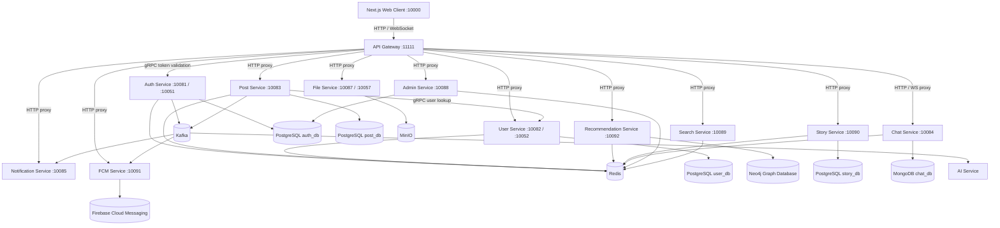

# Social Network Go Microservices


This repository contains a Go-based social network platform built as a set of independently deployable microservices. It includes the backend services, protobuf contracts, Docker development infrastructure, operational dashboards, and a Next.js web client.

The system uses an API Gateway as the public entry point, then routes traffic to domain services over HTTP, WebSocket, and gRPC. PostgreSQL (Database-per-Service pattern), Neo4j (Graph Recommendation Engine), Redis, MongoDB, Kafka, MinIO, and Firebase Cloud Messaging (FCM) provide the backing infrastructure.

## Current Capabilities

- Account registration with Cloudflare Turnstile CAPTCHA protection, login, refresh tokens, logout, password reset, email resend verification, Google OAuth, and two-factor authentication.
- Profile, friend, block, and friend-request management backed by PostgreSQL (`user_db`).
- Posts, comments, feeds, likes, file attachment resolution, and notification publishing backed by PostgreSQL (`post_db`).
- Web Push Notifications and FCM device token registration backed by Firebase Cloud Messaging (`fcm-service`).
- Real-time chat, group chat, voice messages, WebRTC call signaling, and call history.
- File upload/download through MinIO, including presigned access.
- Admin statistics, user/post moderation, ads, announcements, and operational controls.
- Graph recommendation algorithms ("People You May Know", "Personalized Newsfeed Ranking") backed by Neo4j.
- API Gateway rate limiting, CORS, JWT validation through gRPC, and admin-only observability APIs.
- Log, container, profiler, and service health dashboards exposed by the gateway.
- Next.js UI with home feed, chats, profile, admin dashboard, settings, ads, localization, and CAPTCHA bot protection.

## Architecture


```mermaid
graph TD
    Client[Next.js Web Client :10000] -->|HTTP / WebSocket| Gateway[API Gateway :11111]

    Gateway -->|gRPC token validation| Auth[Auth Service :10081 / :10051]
    Gateway -->|HTTP proxy| User[User Service :10082 / :10052]
    Gateway -->|HTTP proxy| Post[Post Service :10083]
    Gateway -->|HTTP / WS proxy| Chat[Chat Service :10084]
    Gateway -->|HTTP proxy| Notification[Notification Service :10085]
    Gateway -->|HTTP proxy| File[File Service :10087 / :10057]
    Gateway -->|HTTP proxy| Admin[Admin Service :10088]
    Gateway -->|HTTP proxy| Search[Search Service :10089]
    Gateway -->|HTTP proxy| Story[Story Service :10090]
    Gateway -->|HTTP proxy| FCM[FCM Service :10091]
    Gateway -->|HTTP proxy| Rec[Recommendation Service :10092]

    Auth --> AuthDB[(PostgreSQL auth_db)]
    Auth --> Redis[(Redis)]
    User --> UserDB[(PostgreSQL user_db)]
    User --> Redis
    Post --> PostDB[(PostgreSQL post_db)]
    Post --> Redis
    Post -->|gRPC user lookup| User
    Rec --> Neo4j[(Neo4j Graph Database)]
    Rec --> Redis
    Story --> StoryDB[(PostgreSQL story_db)]
    Story --> Redis
    Chat --> Mongo[(MongoDB chat_db)]
    Chat --> Redis
    File --> MinIO[(MinIO)]
    Admin --> AuthDB
    Admin --> Redis
    Search --> Redis
    FCM --> Firebase[(Firebase Cloud Messaging)]
    Auth --> Kafka[(Kafka)]
    Post --> Kafka
    Kafka --> Notification
    Kafka --> FCM
    Kafka --> AI[AI Service]
```

## Repository Layout

```text
.
├── admin-service/         # Admin stats, moderation, ads, announcements
├── ai-service/            # Kafka consumer for AI-assisted content processing
├── api-gateway/           # Public gateway, auth middleware, rate limits, dashboards
├── auth-service/          # Accounts, JWT, OAuth, 2FA, CAPTCHA, password reset, email flows
├── chat-service/          # Chat, group chat, WebSocket transport, WebRTC signaling
├── file-service/          # MinIO-backed file storage and presigned URLs
├── notification-service/  # Notification delivery worker
├── post-service/          # Posts, comments, feeds, notification publisher
├── recommendation-service/# Neo4j Graph Recommendations & candidate ranking
├── search-service/        # User/content search
├── story-service/         # Story publishing and retrieval
├── user-service/          # Profiles, social graph, friendship, blocks
├── migrations/            # Versioned SQL DDL migration files (auth_db, user_db, post_db, story_db)
├── pb/                    # Protobuf contracts and generated Go stubs
├── profiler/              # Shared in-process profiler helpers
├── logger/                # Shared logging utilities
├── scripts/               # Nginx, migration, deploy, and test helper scripts
├── docs/                  # Feature and architecture notes
├── plans/                 # Implementation plans and feature notes
├── social-network-ui/     # Next.js web frontend
├── Dockerfile             # Multi-service Go image build
├── docker-compose.yml     # Local infrastructure only
├── docker-compose.dev.yml # Full local stack with services and Nginx gateway LB
├── docker-compose.prod.yml
├── Makefile
├── start-dev.sh
└── stop-dev.sh
```

## Prerequisites

- Go 1.22 or newer
- Docker and Docker Compose
- Node.js 20 or newer for `social-network-ui`
- npm or pnpm for frontend dependencies
- Access to required external providers if enabled: SMTP, Google OAuth, Cloudflare Turnstile, Gemini, and Stringee/WebRTC configuration

## Configuration

Local secrets belong in `.env` files and are ignored by git. Do not commit real credentials.

Common environment variables:

| Variable | Default | Purpose |
| --- | --- | --- |
| `GATEWAY_PORT` | `11111` | API Gateway HTTP port |
| `AUTH_HTTP_PORT` | `10081` | Auth service HTTP port |
| `AUTH_GRPC_PORT` | `10051` | Auth service gRPC port |
| `USER_HTTP_PORT` | `10082` | User service HTTP port |
| `USER_GRPC_PORT` | `10052` | User service gRPC port |
| `POST_HTTP_PORT` | `10083` | Post service HTTP port |
| `CHAT_HTTP_PORT` | `10084` | Chat service HTTP/WebSocket port |
| `NOTIFICATION_HTTP_PORT` | `10085` | Notification service HTTP port |
| `FILE_HTTP_PORT` | `10087` | File service HTTP port |
| `FILE_GRPC_PORT` | `10057` | File service gRPC port |
| `ADMIN_HTTP_PORT` | `10088` | Admin service HTTP port |
| `SEARCH_HTTP_PORT` | `10089` | Search service HTTP port |
| `STORY_HTTP_PORT` | `10090` | Story service HTTP port |
| `FCM_HTTP_PORT` | `10091` | FCM service HTTP port |
| `RECOMMENDATION_HTTP_PORT` | `10092` | Recommendation service HTTP port |
| `POSTGRES_DSN` | local PostgreSQL DSN | PostgreSQL connection (Database-per-Service) |
| `NEO4J_URI` | `neo4j://localhost:7687` | Neo4j Graph Recommendation Engine |
| `REDIS_ADDR` | `localhost:6379` | Redis connection |
| `MONGO_URI` | service default | MongoDB chat history |
| `KAFKA_ADDR` | `localhost:9092` | Kafka broker |
| `MINIO_ENDPOINT` | `localhost:9000` | MinIO API endpoint |
| `CAPTCHA_SECRET_KEY` | empty string | Cloudflare Turnstile Secret Key for backend validation (`auth-service`) |
| `CAPTCHA_ENABLED` | `true` | Enable or disable CAPTCHA verification in auth service |
| `NEXT_PUBLIC_CAPTCHA_SITE_KEY` | empty string | Cloudflare Turnstile Site Key for frontend widget (`social-network-ui`) |
| `NEXT_PUBLIC_FIREBASE_*` | project configs | Web Push Notification config for Next.js UI |
| `FRONTEND_URL` | `http://localhost:10000` | Frontend URL used in auth flows |                  # Feature and architecture notes
├── plans/                 # Implementation plans and feature notes
├── social-network-ui/     # Next.js web frontend
├── Dockerfile             # Multi-service Go image build
├── docker-compose.yml     # Local infrastructure only
├── docker-compose.dev.yml # Full local stack with services and Nginx gateway LB
├── docker-compose.prod.yml
├── Makefile
├── start-dev.sh
└── stop-dev.sh
```

## Prerequisites

- Go 1.22 or newer
- Docker and Docker Compose
- Node.js 20 or newer for `social-network-ui`
- npm or pnpm for frontend dependencies
- Access to required external providers if enabled: SMTP, Google OAuth, Gemini, and Stringee/WebRTC configuration

## Configuration

Local secrets belong in `.env` files and are ignored by git. Do not commit real credentials.

Common environment variables:

| Variable | Default | Purpose |
| --- | --- | --- |
| `GATEWAY_PORT` | `11111` | API Gateway HTTP port |
| `AUTH_HTTP_PORT` | `10081` | Auth service HTTP port |
| `AUTH_GRPC_PORT` | `10051` | Auth service gRPC port |
| `USER_HTTP_PORT` | `10082` | User service HTTP port |
| `USER_GRPC_PORT` | `10052` | User service gRPC port |
| `POST_HTTP_PORT` | `10083` | Post service HTTP port |
| `CHAT_HTTP_PORT` | `10084` | Chat service HTTP/WebSocket port |
| `NOTIFICATION_HTTP_PORT` | `10085` | Notification service HTTP port |
| `FILE_HTTP_PORT` | `10087` | File service HTTP port |
| `FILE_GRPC_PORT` | `10057` | File service gRPC port |
| `ADMIN_HTTP_PORT` | `10088` | Admin service HTTP port |
| `SEARCH_HTTP_PORT` | `10089` | Search service HTTP port |
| `STORY_HTTP_PORT` | `10090` | Story service HTTP port |
| `FCM_HTTP_PORT` | `10091` | FCM service HTTP port |
| `RECOMMENDATION_HTTP_PORT` | `10092` | Recommendation service HTTP port |
| `POSTGRES_DSN` | local PostgreSQL DSN | PostgreSQL connection (Database-per-Service) |
| `NEO4J_URI` | `neo4j://localhost:7687` | Neo4j Graph Recommendation Engine |
| `REDIS_ADDR` | `localhost:6379` | Redis connection |
| `MONGO_URI` | service default | MongoDB chat history |
| `KAFKA_ADDR` | `localhost:9092` | Kafka broker |
| `MINIO_ENDPOINT` | `localhost:9000` | MinIO API endpoint |
| `NEXT_PUBLIC_FIREBASE_*` | project configs | Web Push Notification config for Next.js UI |
| `FRONTEND_URL` | `http://localhost:10000` | Frontend URL used in auth flows |

See service-specific `config/config.go` files for the full set of supported variables.

## Quick Start: Local Backend

Start infrastructure only:

```bash
make infra-up
```

Install and build Go services:

```bash
make tidy
make build
```

Run all Go services in the background:

```bash
./start-dev.sh
```

Stop local Go services:

```bash
./stop-dev.sh
```

Stop infrastructure:

```bash
make infra-down
```

## Quick Start: Full Docker Development Stack

The development compose file builds the Go services, runs infrastructure, scales selected services, and exposes the gateway through Nginx on port `11111`.

```bash
docker compose -f docker-compose.dev.yml up --build
```

The default backend entry point is:

```text
http://localhost:11111
```

## Quick Start: Frontend

```bash
cd social-network-ui
npm install
npm run dev
```

The web UI runs at:

```text
http://localhost:10000
```

Production build:

```bash
cd social-network-ui
npm run build
npm run start
```

## Common Commands

| Command | Description |
| --- | --- |
| `make tidy` | Run `go mod tidy` |
| `make test` | Run all Go tests with `go test -v -count=1 ./...` |
| `make build` | Build all Go service binaries into `bin/` |
| `make dev` | Build, stop existing local binaries, and start all Go services |
| `make infra-up` | Start local PostgreSQL, Neo4j, Redis, MongoDB, Kafka, and MinIO |
| `make infra-down` | Stop local infrastructure |
| `make run-gateway` | Run API Gateway directly with `go run` |
| `make run-auth` | Run Auth service directly |
| `make run-user` | Run User service directly |
| `make run-post` | Run Post service directly |
| `make run-chat` | Run Chat service directly |
| `make run-notif` | Run Notification service directly |
| `make run-ai` | Run AI service directly |
| `make run-admin` | Run Admin service directly |
| `make dev-restart svc=auth-service` | Rebuild and restart one service binary |

## API Gateway Routes

Public routes include:

- `GET /health`
- `POST /v1/auth/login`
- `POST /v1/auth/login-admin`
- `POST /v1/auth/refresh`
- `POST /v1/auth/forgot-password`
- `POST /v1/auth/reset-password`
- `GET /v1/auth/google/login`
- `GET /v1/auth/google/callback`
- `GET /v1/announcement`
- `GET /v1/files/:id`

Authenticated route groups include:

- `/v1/auth/*`
- `/v1/users/*`
- `/v1/friends/*`
- `/v1/blocks/*`
- `/v1/friend-request/*`
- `/v1/posts/*`
- `/v1/comments/*`
- `/v1/chat/*`
- `/v1/call/*`
- `/v1/notifications/*`
- `/v1/files/*`
- `/v1/search/*`
- `/v1/stories/*`
- `/v1/ads/*`

Admin-only route groups include:

- `/v1/admin/*`
- `/v2/statistics/*`
- selected gateway observability APIs

## Observability

The API Gateway exposes browser dashboards:

| Path | Purpose |
| --- | --- |
| `/logs` | Log search and streaming UI |
| `/containers` | Container dashboard |
| `/profiler` | Aggregated profiler dashboard |
| `/monitor` | Service health dashboard |
| `/monitor/health` | Service health API |

Admin-only APIs are protected by JWT and `ADMIN` role checks.

## WebRTC Calling

The chat service coordinates WebRTC signaling over WebSocket and stores call state in Redis/MongoDB. See `docs/calling_system.md` for packet formats, Redis keys, MongoDB call documents, and 1-to-1/group call sequence diagrams.

## Generated and Local Files

The repository intentionally ignores local-only outputs:

- `.env` and `.env.*`
- `logs/` and nested service log folders
- `bin/`
- frontend `node_modules/`, `.next/`, and build output
- IDE files such as `.idea/` and `.vscode/`
- temporary artifacts and profiler test output

Generated protobuf files in `pb/` are committed because the Go services import them directly.

## Testing

Run backend tests:

```bash
make test
```

Run frontend checks:

```bash
cd social-network-ui
npm run build
```

Some integration paths require local infrastructure from `make infra-up` or `docker-compose.dev.yml`.

## Service & Infrastructure Ports

| Service / Infrastructure | Protocol / Interface | Port | Host Address / Notes |
| :--- | :--- | :--- | :--- |
| **Next.js Web UI** | HTTP | `10000` | `http://<VPS_IP>:10000` (Docker Container) |
| **API Gateway** | HTTP | `11111` | `http://<VPS_IP>:11111` (Entrypoint) |
| **Auth Service** | HTTP / gRPC | `10081` / `10051` | Internal Microservice |
| **User Service** | HTTP / gRPC | `10082` / `10052` | Internal Microservice |
| **Post Service** | HTTP | `10083` | Internal Microservice |
| **Chat Service** | HTTP / WS | `10084` | Internal Microservice |
| **Notification Service** | HTTP / WS | `10085` | `http://<VPS_IP>:10085/v1/notifications/ws` |
| **FCM Service** | HTTP / gRPC | `10086` / `10056` | Internal Microservice |
| **File Service** | HTTP / gRPC | `10087` / `10057` | Internal Microservice |
| **Admin Service** | HTTP | `10088` | Internal Microservice |
| **Search Service** | HTTP | `10089` | Internal Microservice |
| **Story Service** | HTTP | `10090` | Internal Microservice |
| **AI Service** | HTTP | `10091` | Internal Microservice |
| **Recommendation Service** | HTTP | `10092` | Internal Microservice |
| **PostgreSQL (`auth_db`, etc.)** | PostgreSQL | `15432` | Custom Host Port (Container: `5432`) |
| **Redis Cache** | Redis | `16379` | Custom Host Port (Container: `6379`) |
| **Neo4j Graph Database** | HTTP / Bolt | `17474` / `17687` | Custom Host Ports (Container: `7474`/`7687`) |
| **MongoDB Chat Database** | MongoDB | `27018` | Custom Host Port (Container: `27017`) |
| **MinIO Storage** | API / Console | `19000` / `19001` | Custom Host Ports (Container: `9000`/`9001`) |
| **Kafka Event Broker** | PLAINTEXT | `19092` | Custom Host Port (Container: `9092`) |

## VPS Deployment & CI/CD Pipelines

### 1. Manual VPS Deployment

Deploy all Go microservices and infrastructure to a remote Linux host via SSH:

```bash
# 1. Start Infrastructure (PostgreSQL, Neo4j, Redis, MinIO, Kafka) on VPS
ssh root@<VPS_IP> "mkdir -p /root/social-network"
scp docker-compose.yml root@<VPS_IP>:/root/social-network/
ssh root@<VPS_IP> "cd /root/social-network && docker compose up -d"

# 2. Deploy Go Microservices
./deploy-vps.sh auth-service   # Deploy a single service
./deploy-vps.sh all            # Deploy all 13 microservices

# 3. Deploy Next.js Web UI via Docker
./deploy-ui-vps.sh
```

- Local host parameters (`SERVER_IP`, `SSH_USER`, `SSH_PORT`) are read dynamically from `.env` (git-ignored) or environment variables.
- Service processes run natively on VPS with background PID tracking (`deploy.sh`), and the Next.js UI runs inside a standalone Docker container on port `10000`.

### 2. GitHub Actions CI/CD Architecture

- **Go Microservices CI (`.github/workflows/ci.yml`)**: Runs linting, unit tests, and verifies compilation of all 13 Go services on every push and pull request.
- **Smart Continuous Deployment (`.github/workflows/cd.yml`)**:
  - Triggers **only after CI successfully passes** on `main`/`master`.
  - Uses `git diff` for **Smart Service Change Detection**:
    - If code changes in `auth-service/`, only `auth-service` is compiled and deployed (takes ~10s).
    - If shared code (`internal/`, `go.mod`, `pb/`) changes, all services are updated.
    - If UI code changes, only the Next.js Docker container is rebuilt.
  - Enforces `concurrency` locking to prevent parallel deployment conflicts on the VPS.
- **UI Repository CI/CD (`social-network-ui/.github/workflows/deploy.yml`)**: Independent, self-contained CI/CD workflow for standalone UI repository deployments.

## Security Notes

- Keep JWT, OAuth, SMTP, MinIO, Gemini, and provider credentials in local environment files (`.env`) or deployment secrets.
- `.env` and `.env.*` are ignored by Git to prevent leaking VPS IPs or private credentials.
- Set GitHub Action Repository Secrets (`VPS_HOST`, `VPS_USER`, `VPS_SSH_KEY`, `VPS_PORT`) using a dedicated SSH Deployment Key (`ssh-keygen -t ed25519 -f ~/.ssh/github_deploy_key`).
- Gateway CORS is configured for known local and production origins.
- Gateway JWT validation calls the auth service over gRPC and forwards trusted user context headers downstream.
- Admin operational APIs require both authentication and the `ADMIN` role.
