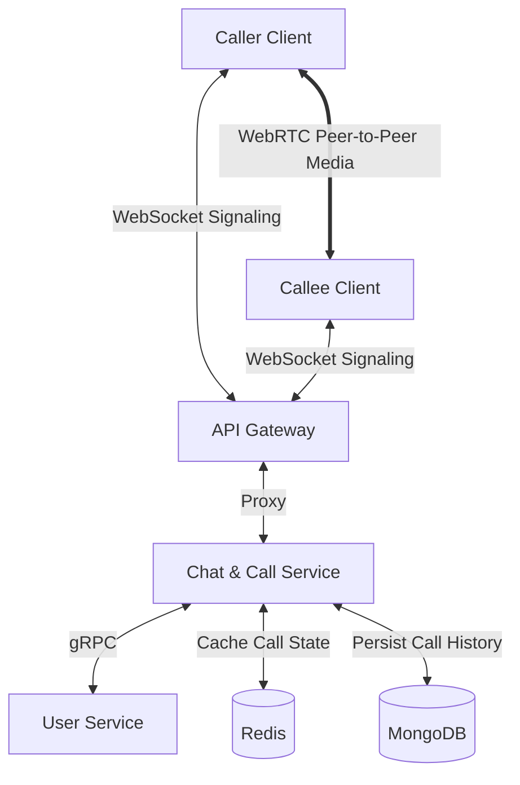
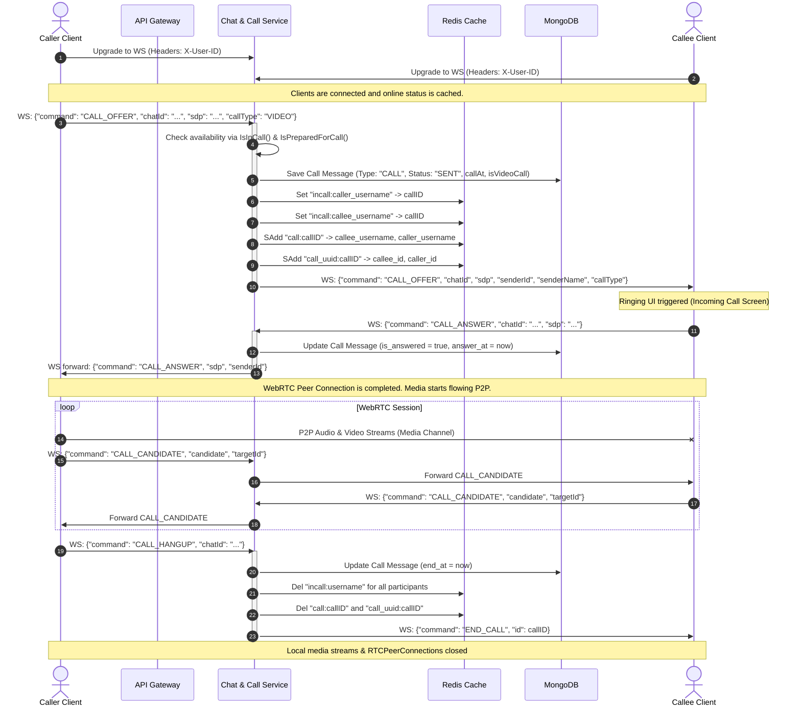
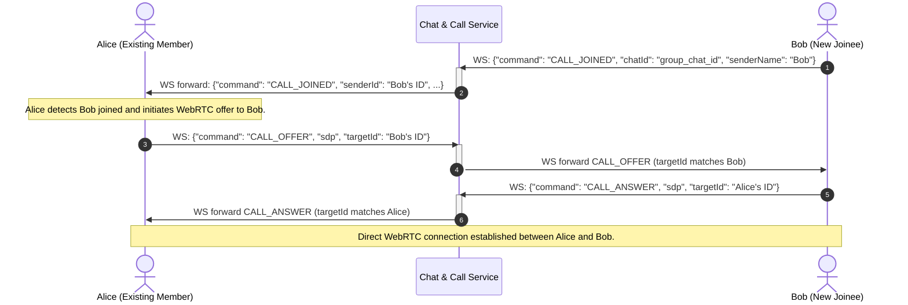

# Calling System Architecture & WebRTC Flow

This document details the design, architecture, and signaling flow of the WebRTC-based voice and video calling feature implemented within the **Chat & Call Service** and **Web UI**.

---

## 1. High-Level Architectural Components



*   **API Gateway:** Proxies WebSocket connections and HTTP requests (`/v1/call/ice-servers`) to the Chat & Call Service.
*   **Chat & Call Service (Go):** Coordinates WebSocket connections, validates user availability, manages call status, updates Redis/MongoDB state, and routes WebRTC signaling messages (`CALL_OFFER`, `CALL_ANSWER`, `CALL_CANDIDATE`, `CALL_HANGUP`).
*   **User Service (Go):** Fetches caller and callee profile information via gRPC.
*   **Redis:** Caches real-time calling state to prevent duplicate call sessions or check user availability (`incall:<username>`, `call:<call_id>`).
*   **MongoDB:** Persists call logs and metadata (start time, answer time, duration, call type).
*   **WebRTC Mesh / P2P Channel:** Transmits media (audio & video) directly between clients once signaling is complete.

---

## 2. 1-to-1 WebRTC Signaling & Connection Sequence

This sequence diagram illustrates a caller initiating a call to a callee, signaling WebRTC local descriptions via WebSocket, exchanging ICE candidates, and terminating the call.



---

## 3. Group Calling Flow (Mesh Architecture)

The system supports multi-party calling using a **Mesh Topology** (each user maintains a 1-to-1 WebRTC connection with every other user). Members joining a group call broadcast `CALL_JOINED` to notify peers.



---

## 4. Database State Management & Persistence

### A. Redis Cache Structure
*   **User In-Call Flag (`incall:<username>`)**:
    *   *Type*: String
    *   *Description*: Identifies whether a user is currently inside a call. Set upon `CALL_OFFER` (or `CALL_JOINED` for groups) and deleted upon `CALL_HANGUP`.
*   **Call Participants Set (`call:<call_id>`)**:
    *   *Type*: Set of Usernames
    *   *Description*: Stores usernames of all active call participants. Used to clean up flags when a call ends.
*   **Call Participant IDs Set (`call_uuid:<call_id>`)**:
    *   *Type*: Set of User IDs
    *   *Description*: Stores user UUIDs of participants, used for routing the final `END_CALL` command to everyone when a hangup occurs.

### B. MongoDB Document Structure (`messages` Collection)
Each call session registers as a message of type `"CALL"` in MongoDB:
```json
{
  "_id": "673f8d8c-526d-4952-ba16-c7304bf9f291",
  "chatId": "b1bc7624-9b2f-488f-a9cb-b2f7ee29d472",
  "sender_id": "04ba77c9-e602-4fca-9325-338cd40a750e",
  "recipient_id": "96c0a37c-387e-4b2a-b340-2d9a0b178af4",
  "content": "Cuộc gọi video",
  "timestamp": "2026-05-31T17:00:00Z",
  "type": "CALL",
  "status": "SENT",
  "call_id": "b1bc7624-9b2f-488f-a9cb-b2f7ee29d472",
  "call_at": "2026-05-31T17:00:00Z",
  "is_video_call": true,
  "is_answered": true,
  "answer_at": "2026-05-31T17:00:05Z",
  "end_at": "2026-05-31T17:15:30Z"
}
```

---

## 5. WebRTC WebSocket Signaling Packet Specifications

### CALL_OFFER
Sent by the caller to propose a WebRTC connection session:
```json
{
  "command": "CALL_OFFER",
  "chatId": "chat-room-uuid",
  "callType": "VIDEO",
  "sdp": "v=0\r\no=- 461173... (SDP description)",
  "targetId": "recipient-user-uuid"
}
```

### CALL_ANSWER
Sent by the callee in response to the caller's SDP offer:
```json
{
  "command": "CALL_ANSWER",
  "chatId": "chat-room-uuid",
  "sdp": "v=0\r\no=- 856612... (SDP description)",
  "targetId": "caller-user-uuid"
}
```

### CALL_CANDIDATE
Exchanged by both parties during connection negotiation to establish network routing paths:
```json
{
  "command": "CALL_CANDIDATE",
  "chatId": "chat-room-uuid",
  "candidate": {
    "candidate": "candidate:842163049 1 udp 1677721855 192.168.1.100 58492 typ srflx raddr...",
    "sdpMid": "0",
    "sdpMLineIndex": 0
  },
  "targetId": "target-user-uuid"
}
```

### CALL_HANGUP
Sent to gracefully disconnect the active session:
```json
{
  "command": "CALL_HANGUP",
  "chatId": "chat-room-uuid"
}
```
