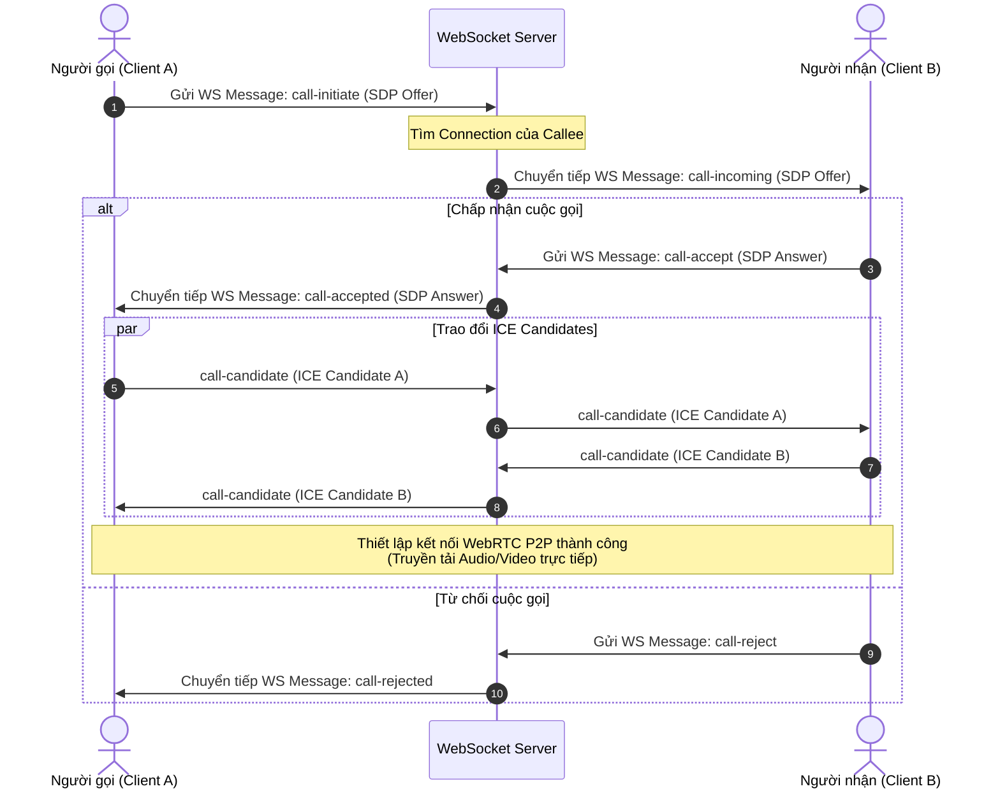

# Kế hoạch triển khai WebRTC Video/Voice Call (Loại bỏ Stringee Call)

Bản kế hoạch này tập trung vào việc **loại bỏ tích hợp Stringee Call API** và tự xây dựng hệ thống **WebRTC Video/Voice Call trực tiếp (Peer-to-Peer)** thông qua máy chủ WebSocket Signaling của `chat-service`.

> [!NOTE]
> Kế hoạch này được triển khai **ngay sau khi hoàn thành tính năng Group Chat** để tận dụng tối đa hạ tầng WebSocket và định dạng phòng chat mới.

---

## 1. Phân tích hiện trạng
- **Hiện tại**: `chat-service` đang sử dụng dịch vụ của **Stringee Call API**. Backend cung cấp endpoint `/v1/stringee/create-token` sinh JWT token giúp Client xác thực và gọi điện qua hạ tầng SDK của Stringee.
- **Mục tiêu**: Loại bỏ hoàn toàn sự phụ thuộc vào bên thứ ba, chuyển sang dùng **WebRTC** để cuộc gọi được truyền tải P2P (Peer-to-Peer) trực tiếp giữa các thiết bị người dùng.
- **Giải pháp**: Tận dụng kết nối WebSocket hiện có của `chat-service` để đóng vai trò làm **Signaling Server** (máy chủ chuyển tiếp các gói tin cấu hình bắt tay WebRTC).

---

## 2. Loại bỏ Stringee API & Cấu hình liên quan

Cần xóa bỏ các thành phần liên quan đến Stringee để làm sạch dự án:
1. **Config**: Xóa `StringeeSid` và `StringeeSecret` trong struct `Config` (`config/config.go`).
2. **Environment**: Xóa các biến môi trường `STRINGEE_API_SID` và `STRINGEE_API_SECRET_KEY` trong file `.env`.
3. **Endpoint**: Xóa endpoint `/v1/stringee/create-token` trong `main.go`.
4. **Handler**: Xóa hàm `CreateStringeeToken` trong `handler/chat_handler.go`.

---

## 3. Thiết kế hệ thống WebRTC Signaling qua WebSocket

WebRTC yêu cầu một cơ chế chuyển tiếp tín hiệu (Signaling) ban đầu để hai peer trao đổi thông tin SDP (Session Description Protocol) và ICE Candidates. Ta sẽ tích hợp trực tiếp cơ chế này vào WebSocket hiện tại.

### 3.1 Quy trình bắt tay (Handshake Flow)



### 3.2 Định nghĩa cấu trúc gói tin WebSocket Signaling

Mở rộng cấu trúc tin nhắn trao đổi qua WebSocket để phân biệt tin nhắn chat và tín hiệu call:

```go
type WSMessage struct {
	// Phân loại: "CHAT_MESSAGE", "CALL_INITIATE", "CALL_ACCEPT", "CALL_REJECT", "CALL_CANDIDATE", "CALL_HANGUP"
	Type      string      `json:"type"`
	ChatID    string      `json:"chatId,omitempty"`
	SenderID  string      `json:"senderId,omitempty"`
	Payload   interface{} `json:"payload,omitempty"` // Chứa nội dung chi tiết
}

// Payload dành cho Call Signal
type CallPayload struct {
	CallType  string      `json:"callType"`            // "AUDIO" hoặc "VIDEO"
	SDP       string      `json:"sdp,omitempty"`       // SDP Offer / Answer
	Candidate interface{} `json:"candidate,omitempty"` // ICE Candidate data
}
```

### 3.3 Logic chuyển tiếp Signaling trên Backend (`chat_service.go`)
Khi nhận một gói tin có `Type` bắt đầu bằng `CALL_`:
1. Xác định đối tượng nhận:
   - Nếu là chat 1-1: Tìm thành viên còn lại của `ChatID`.
   - Nếu là group chat (Gọi nhóm): Tìm tất cả thành viên khác trong nhóm đang có trạng thái online.
2. Server thực hiện chuyển tiếp (Forward) nguyên vẹn gói tin `WSMessage` tới các kết nối WebSocket của người nhận đó.
3. Không lưu các gói tin tín hiệu `CALL_*` này vào MongoDB lịch sử tin nhắn (chỉ lưu tin nhắn báo cuộc gọi nhỡ / cuộc gọi kết thúc nếu cần).

---

## 4. Giải pháp vượt NAT (STUN/TURN Server)

Để cuộc gọi WebRTC kết nối thành công khi hai người dùng ở các mạng khác nhau (nhà mạng di động, mạng công ty, NAT chồng NAT):
- **STUN Server**: Dùng để phát hiện IP public của thiết bị. Có thể sử dụng STUN miễn phí của Google (`stun:stun.l.google.com:19302`).
- **TURN Server**: Dùng để relay (truyền tiếp) media stream khi kết nối P2P trực tiếp bị chặn bởi Firewall. 
- **Triển khai**: 
  - Tự cài đặt **Coturn Server** trên server riêng.
  - Viết REST API `GET /v1/call/ice-servers` trên backend để trả cấu hình TURN credentials động (hạn chế lộ thông tin bảo mật của TURN server).

---

## 5. Lộ trình thực hiện (Roadmap)

1. **Step 1: Cleanup & Setup REST API**
   - Xóa bỏ hoàn toàn code Stringee API.
   - Thêm endpoint `GET /v1/call/ice-servers` cung cấp thông tin cấu hình STUN/TURN cho frontend.
2. **Step 2: Xây dựng bộ khung Signaling trên WS**
   - Cập nhật hàm `HandleIncomingMessages` trong backend để nhận dạng và forward các message kiểu `CALL_*`.
3. **Step 3: Viết logic xử lý cuộc gọi trên Frontend Client**
   - Tích hợp WebRTC API (`RTCPeerConnection`, `navigator.mediaDevices.getUserMedia`).
   - Xử lý các sự kiện click nút gọi, nút nghe, tắt camera/mic, gác máy.
4. **Step 4: Kiểm thử ngoài mạng LAN**
   - Kiểm tra khả năng bắt tay và thiết lập cuộc gọi giữa thiết bị sử dụng Wifi và thiết bị sử dụng mạng di động 4G qua TURN server.
5. **Step 5: Mở rộng gọi nhóm (Group Calling)**
   - Trong giai đoạn đầu, áp dụng mô hình **Mesh (Full Mesh)** cho nhóm nhỏ (dưới 4 người) - mỗi thiết bị kết nối P2P trực tiếp tới tất cả thiết bị còn lại.
   - Nếu quy mô nhóm lớn hơn, chuẩn bị hướng tích hợp giải pháp **SFU (Selective Forwarding Unit)** như Janus hoặc Mediasoup.
